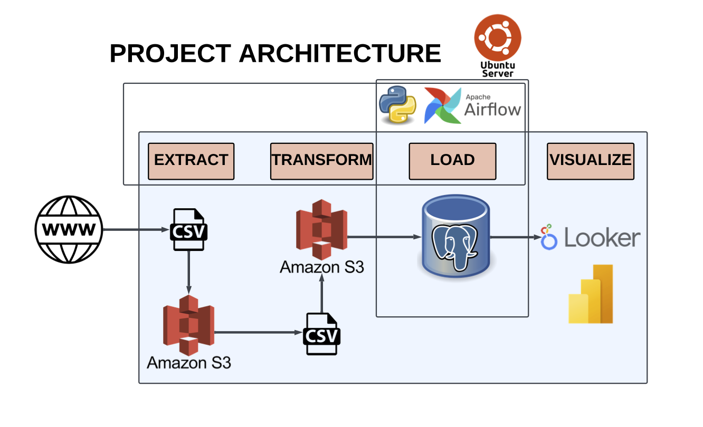
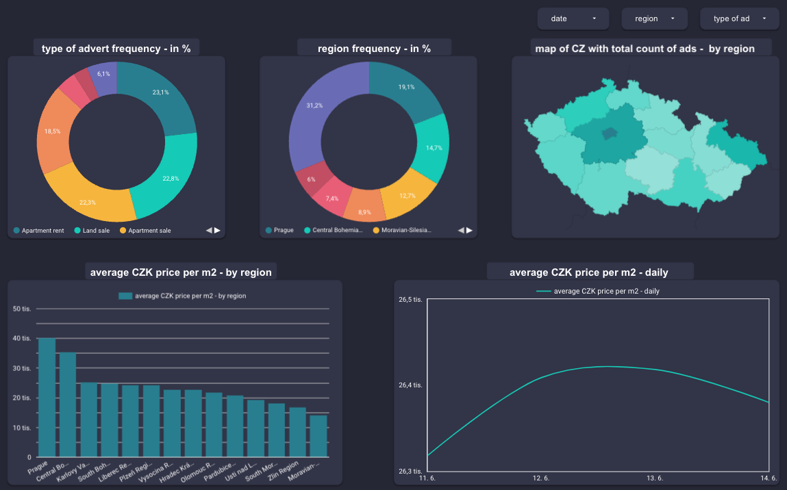

# Real Estate Data Engineering project

*In this repository you can find an e2e data engineering ETL for real estate data for further analysis. The project is designed to scrape, store, transform and visualize data*


## Architecture and technologies

In the picture below I displayed the data flow as well as technologies used. Firstly, lets describe the technologies and then explain what each does in my project.
- **Python3**
  - Python scripts scrape, transform and load data to my database
- **PostgreSQL**
  - PostgreSQL database as an opensource RDBMS is a perfect technology for storing my project data in SQL format for quick and efficient querying and analysis.
- **AWS S3**
  - S3 is in this project used to store raw data files in CSV format as well as clean data ready for database load, it is also used for safe archivation of already processed data files.
- **Google Looker**
  - I used Looker as my visualization tool to present data in a human-readable and visually pleasing format, I chose Looker instead of PowerBI, because of free option to share dashboard with others.
- **Apache Airflow**
  - My ETL process is orchestrated and scheduled with Airflow, which also helps us to monitor the execution process of the ETL.
- **Ubuntu Server version** 
  - Python, PostgreSQL server and Apache Airflow are hosted on a Linux server, which ensures stable, high-performance and secure environment for this project.



### Data flow process
- Every day at scheduled time Airflow [dag.py](scripts/dag.py) triggers the first script [extract.py](scripts/extract.py) that extracts website content and saves it to S3 storage in CSV format. 
- There is a S3 Sensor in Airflow that detects when there is a new file in the S3 location for raw data, when that happens the next Airflow task is triggered which executes the [transform.py](scripts/transform.py). The transformation file cleans data and makes it more readable, useful and ready for loading to our database. 
- After the execution of that script there is next Airflow task which is basically the same S3 Sensor, just in another folder. It detects a new file ready for loading to our database, when that happens that task triggers the last python file [load_db.py](scripts/load_db.py)
- The last script [load_db.py](scripts/load_db.py) accesses data on S3 and loads it to PostgreSQL database.
- The last part is visualization, where I configured Looker studio to access data every 12 hours from my database and I made an basic informative dashboard out of it.


## First steps - Environment
### Linux (optional)
I decided to have my whole project running on Ubuntu Server for a number of reasons, firstly because I experienced some issue with Airflow on macOS, also I wanted to challenge myself to work in a fully Linux CLI environment, the third reason was a pleasing idea of having the project running completely on a separate machine, with minimal interfere from my side.
However it is not necessary to run this project on the Linux environment, macOS and Windows is also possible, however on Windows Airflow is officially available only in Docker.
#### Linux setup
I downloaded the Linux into my USB drive, made it a bootable image to be able to install it on one of my computers. For more details about the Linux installation there are many online resources such as [Linux Server Installation](https://www.youtube.com/watch?v=zs2zdVPwZ7E) and also **very important [After-installation](https://www.youtube.com/watch?v=0AIUwu2a62M)**.

### PostgreSQL, Airflow, AWS and other necessaries
#### PostgreSQL
To be able to use PostgreSQL I downloaded it with:
```
sudo apt update && sudo apt upgrade
sudo apt -y install postgresql-14
```
Afterwards configured it to be able to access it from other computers on my network, by editing postgresql.conf and pg_hba.conf, see the [PostgreSQL official documentation](https://www.postgresql.org/docs/14/index.html). 
However because I used the Looker studio which accesses PostgreSQL outside my network, I also had to do these steps:
- create a new port forwarding rule that maps the external port (e.g., 5432) to the internal IP address of the server running PostgreSQL and the corresponding port (also 5432 by default)
- ensure that my server allows incoming connections to the PostgreSQL port with this code:`sudo ufw allow 5432` 
- also restrict access to only trusted IP addresses, Google Looker has on it's website the default IP addresses used to access the database
- also it is a good practice to enable SSL encryption, or at least have a very strong password to minize security risks
- I as well did setup an dynamic DNS that associates a domain name with a changing IP address, which allowed me to access my resources even with dynamic IP address
- Now I was able to connect from an device not on my network to PostgreSQL server running on my server

I then set up the PostgreSQL database, created a new secure user and my PostgreSQL was ready to receive data.

#### Apache Airflow
I created a new virtual environment for this project, to have all necessary modules in one separate location. Then installed pip:
``` 
sudo apt update && sudo apt upgrade
sudo apt install python3-pip
```
and was ready to install Airflow.
I used this command:
```
pip install -r requirements.txt apache-airflow
```
where requirements were [Apache Airflow 2.6.1 official requirements for Python 3.10](https://raw.githubusercontent.com/apache/airflow/constraints-2.6.1/constraints-3.10.txt).
After that I wanted to change the Airflow default settings, because by default the Airflow uses SQLite as it's database and SequentialExecutor, I changed it to LocalExecutor and to my PostgreSQL in airflow.cfg.

#### AWS 

For this project I decided to use AWS S3 to handle and store my data. To be able to use S3 AWS account is needed, I used my account with Trial Tier. After setting the account it is necessary to create a bucket with name of our choice, which will serve as a reliable space for data storage and archival purposes. For access control and security, I set up an AWS IAM role, which provided the necessary permissions to access the bucket and interact with the stored data. Please take in mind that the IAM role and policies must be very carefully configured to allow access only to services needed, in my case for managing data in my S3 storage.

This next step is optional, but highly recommended, I then installed AWS CLI, because I did not want to have in my code explicitly sensitive IAM role access keys, I configured the AWS CLI with my access keys, and now whenever I run something that communicates with AWS, it will use those keys.
> AWS access keys are highly sensitive information. They should always be kept confidential and should never be included directly in the code.

## ETL code
for executing all parts of code, I needed these libraries installed to my virtual environment (Python 3.10.6):
```
pip3 install boto3
pip3 install pandas
pip3 install psycopg2
pip3 install sqlalchemy
pip3 install requests
pip3 install beautifulsoup4
pip3 install unidecode
pip3 install pendulum
```
However I provide the [requirements.txt](scripts/requirements.txt) file in the depository.

### [Extract.py](scripts/extract.py)
- firstly I import all the necesary libraries and modules for this part
- I have divided my script into 5 functions, where
- `get_page_content` function takes a page number as input and returns the parsed HTML content from the desired website
- `extract_property_data` this function takes the HTML content as input and extract the specified fields such as type of advert, address, size, design, price and link for each property ad on the page, at the end it returns a list of properties.
- `clean_data` takes the previous property list as input and converts it to pandas df, applies unidecode function to replace czech-specific letters to international standards and at the end the df is index reset and returned
- `df_to_csv` takes the clean df as input, converts it to csv and returns the file as a StringIO object
- `run_extract` function is the main function that is responsible for execution of the scraping process. Defines empty list, that will store extracted data, the function also iterates over the desired range of page numbers and it also handles a delay of 1 second to prevent errors: *timeout* or *too many requests*

### [Transform.py](scripts/transform.py)
- this code is also divided in 5 functions
- `get_s3_file_key` takes s3 client, bucket name, and in specified location returns key to file if found
- `fetch_data` takes s3 client, bucket name, file key as inputs and retrieves csv file from s3 using the file key, creates a df from the csv content and returns the df as well as copy of it for archive reasons
- `clean_and_transform_data` this function takes the properties df and file key as inputs. it performs dropping duplicates, replacing special characters, cleaning and transforms price and size columns to int type, extracts from the address the region part, calculates the price per m2, adds dump date column and reorders colums. At the end it returns clean dataframe 
- `upload_to_s3` takes s3 client, bucket, file key, properties df and properties df archive as inputs and uploads the transformed df to a location ready to database load and the old df to archive location of raw data location
- `transformation` as main function orchestrates the entire process. defines the s3 client, sets the bucket name and source key and calls other functions in the right order, to fetch, clean, transform and upload data to s3 to be ready for next processes.

### [Load_db.py](scripts/load_db.py)
- `get_s3_file_key` takes the s3 client, bucket and source ke as input and searches for a CSV file in specified location ready for db loading, at the end returns the file key if found
- `get_file_data` takes the s3 client, bucket, and file key as inputs, takes the CSV file from s3, creates df and returns the df
- `get_db_connection` establishes a connection to the PostgreSQL database using the provided details, returns the connection object
- `send_data_to_db` takes the df and connection object as inputs and creates the sqlachemy engine for data loading, also defines the table name and datatypes, at the end it sends the df to the defined table using the to_sql method
- `archive_data` takes s3 client, bucket, file key and df as input, archives the loaded data as a CSV file in the specified archive location and at the end deletes the processed file from original location
- `db_load` as the main function orchestrates the data loading process, defines s3 client, bucket, and source key. Calls the other functions in to correct order, after the `send_data_to_db` function also closes conenction.

### [Airflow DAG](scripts/etldag.py)
- to be able to run these scripts with Airflow I defined an Airflow DAG, with speficied default arguments, description, and schedule interval
- `run_extract_data` this a python operator task that executes the run_extract function from the [extract.py](scripts/extract.py) file.
- `s3_create_object_raw_data` i decided to use the Airflow operator to create the file with data from previous function, because I was experiencing some issues when I defined the saving function in the [extract.py](scripts/extract.py), therefore it is handled by this 
- `s3_sensor_for_new_raw` this task waits for a new raw data file to be created in the specified location of my bucket
- `transform_data` is a python operator that calls the main function from [transform.py](scripts/transform.py) file
- `s3_sensor_for_db_load` again an s3 sensor, this one wait for a file in the location for data ready to load to db
- `load_data_to_db` executes the main function of the [load_db.py](scripts/load_db.py) 
- `>>` at the end are operators used to define dependencies and execution order of the tasks

### Visualization
As stated before I used the Looker for my visulization. As a tool Looker is free, very intuitive and easy to set up, however it does not provide as many possible tools and features as other tools like PowerBI or Tableau. However for this project Looker was perfectly good
- I connected to my PostgreSQL server with my previously created domain and other login details
- Then I selected my table from the database as data source, edited some columns such as the dump_date format to be able to use dates in my dashboard, or the region column to a geographical data, to be able to visualize location of the properties



